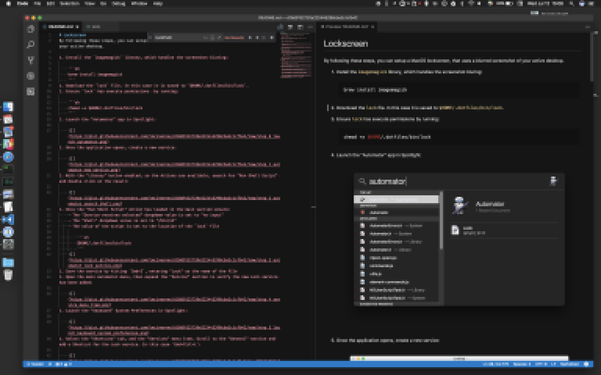
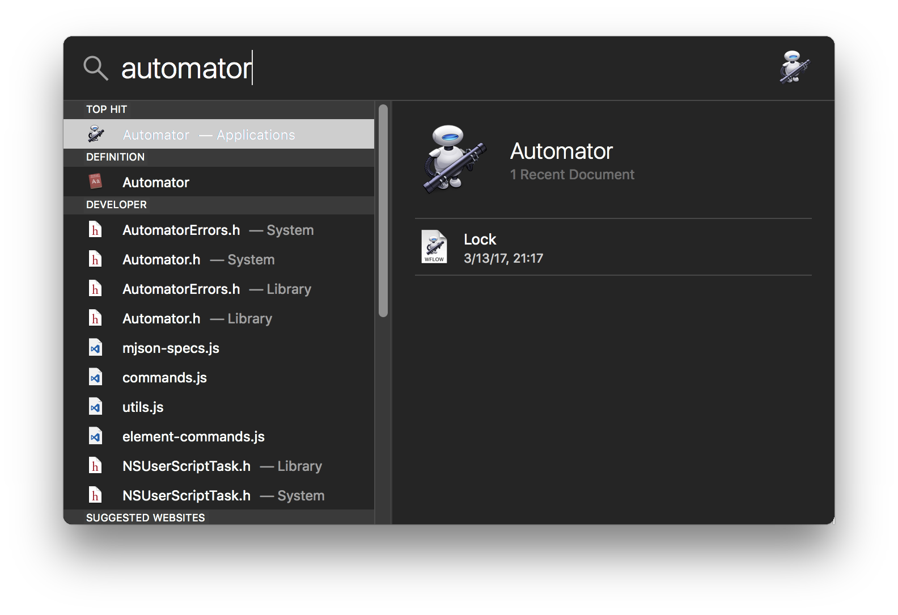
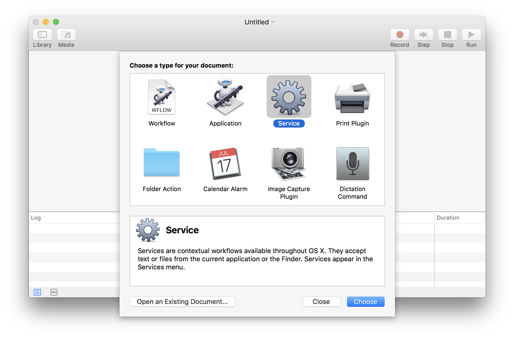
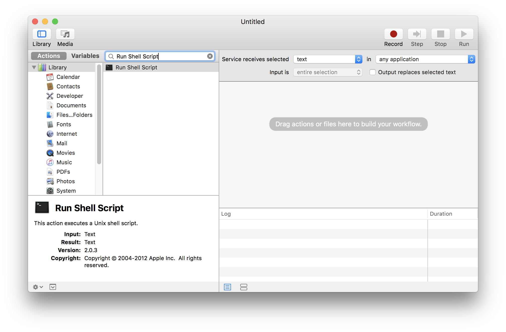
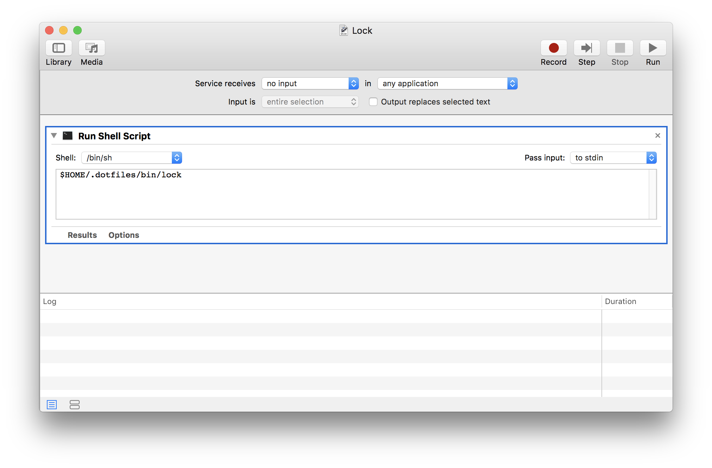
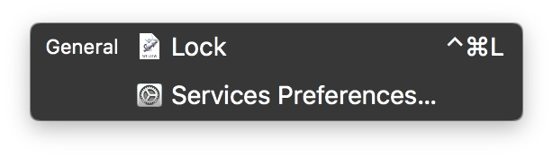
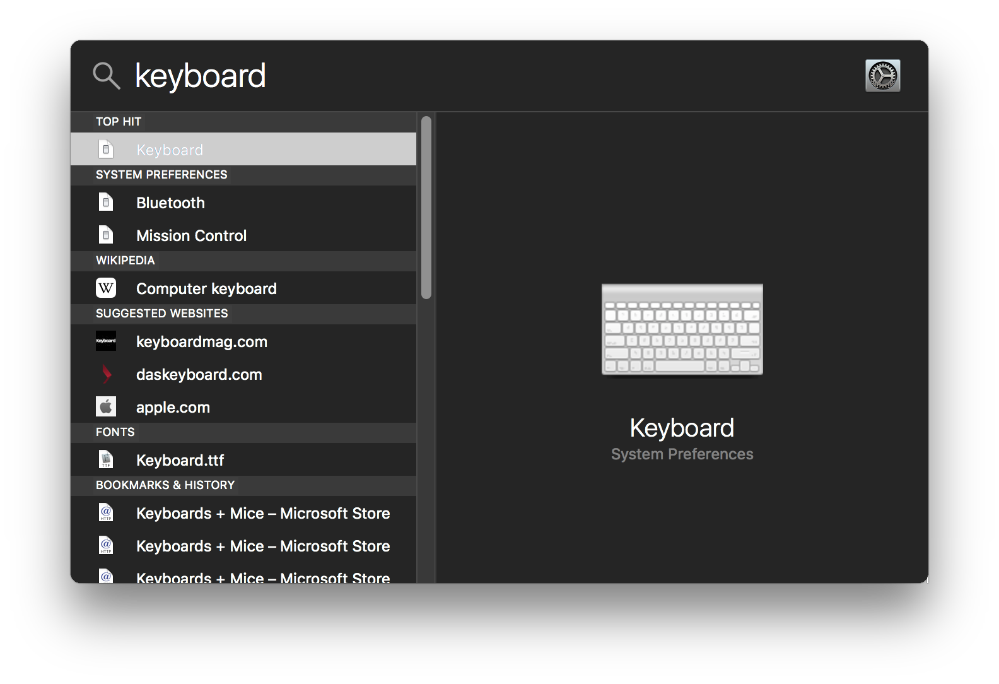
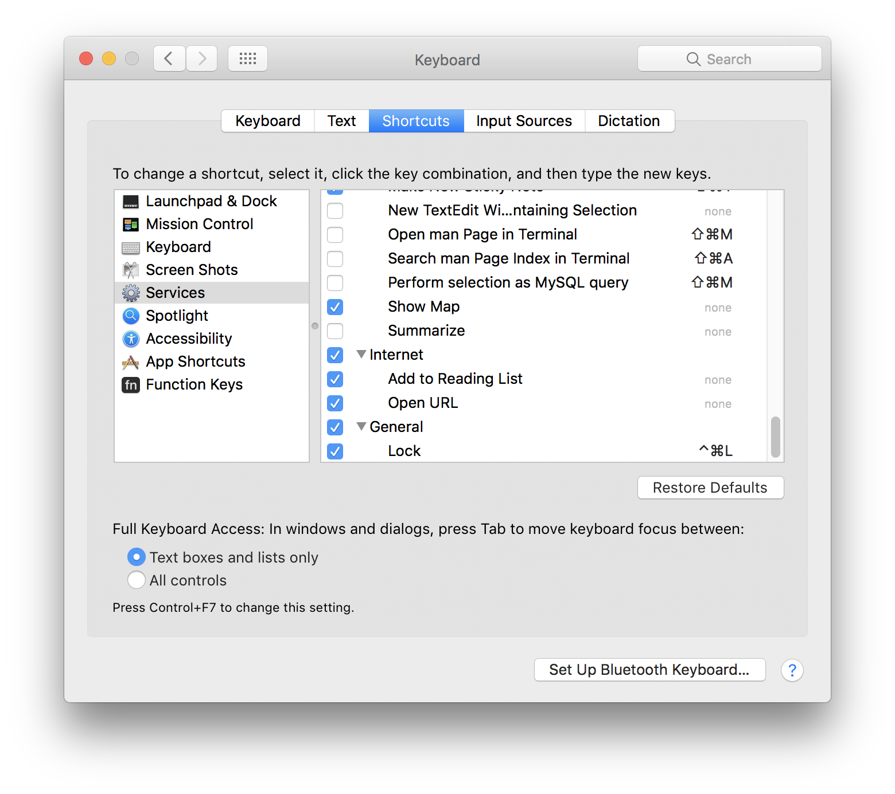
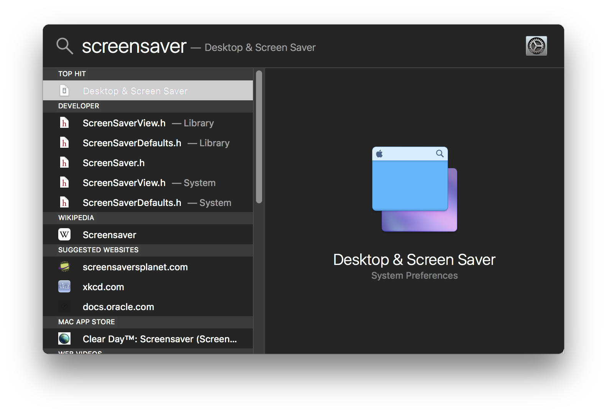
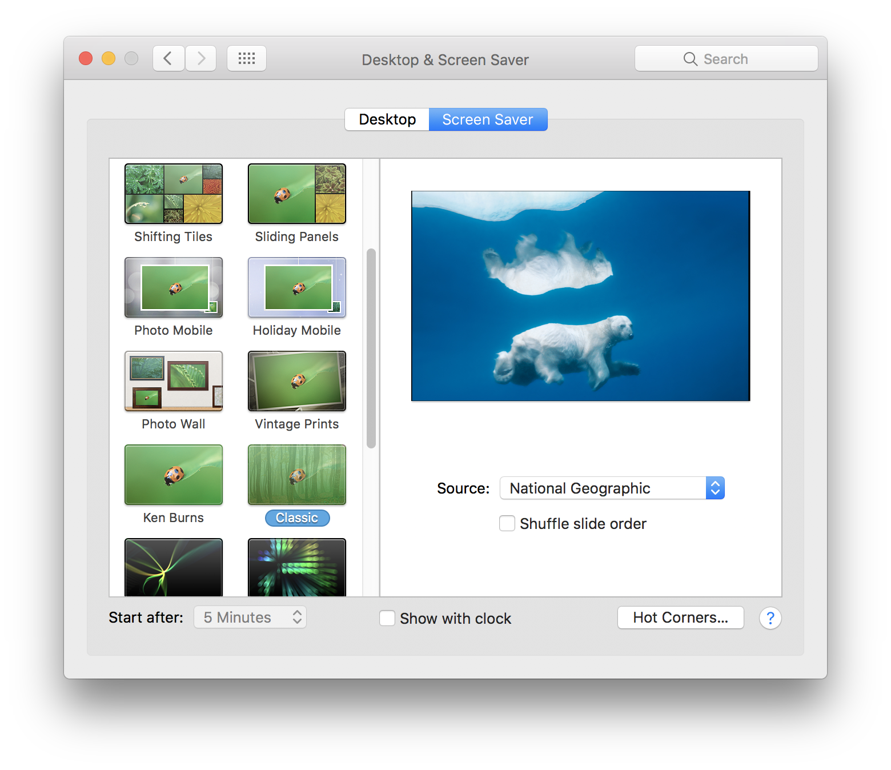

# Lockscreen
By following these steps, you can setup a MacOS lockscreen, that uses a blurred screenshot of your active desktop.



## Instructions
1. Install the `imagemagick` library, which handles the screenshot bluring:

    ```sh
    brew install imagemagick
    ```
1. Download the `lock` file. In this case it is saved to `$HOME/.dotfiles/bin/lock`
1. Ensure `lock` has execute permissions  by running:

    ```sh
    chmod +x $HOME/.dotfiles/bin/lock
    ```
1. Create a directory to store screenshots:

    ```sh
    mkdir -p $HOME/Pictures/Lockscreen
    ```
1. Launch the "Automator" app in Spotlight:

    
1. Once the application opens, create a new service:

    
1. With the "Library" button enabled, so the Actions are available, search for "Run Shell Script" and double click on the result:

    
1. Once the "Run Shell Script" Action has loaded in the main section ensure:
    - The "Service receives selected" dropdown value is set to "no input"
    - The "Shell" dropdown value is set to "/bin/sh"
    - The value of the script is set to the location of the `lock` file

        ```sh
        $HOME/.dotfiles/bin/lock
        ```
    
1. Click the "Run" button to test the new service. Assuming your volume is turned up, you should hear a camera shutter followed by the loading of the screensaver
1. Save the service by hitting `Cmd+S`, entering "Lock" as the name of the file
1. Open the main Automator menu, then expand the "Service" section to verify the new Lock service has been added:

    **NOTE:** If the menu item isn't showing up, you might need to restart your machine.

    
1. Launch the "Keyboard" System Preferences in Spotlight:

    
1. Select the "Shortcuts" tab, and the "Services" menu item. Scroll to the "General" section and add a Shortcut for the Lock service. In this case `Cmd+Ctrl+L`:

    
1. Launch the "Desktop & Screen Saver" System Preferences in Spotlight:

    
1. Click on the "Screen Saver" tab, scroll down and select the "Classic" screensaver:

    
1. Open the "Source" dropdown, select the "Choose Folder..." option, navigate to and select the `$HOME/Pictures/Lockscreen` folder
1. Test that everything works by hitting the `Cmd+Ctrl+L` key combination.

